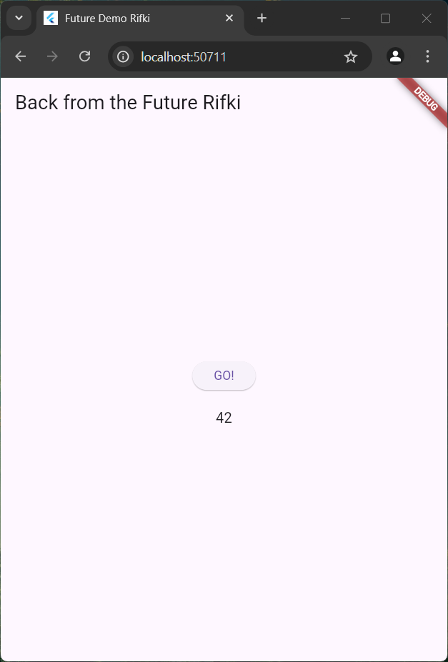
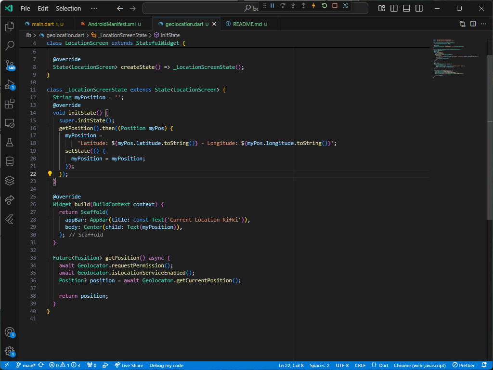

# Praktikum 1

## Soal 1

## Soal 2

## Soal 3

Penjelasan Substring : Jika panjang teks (value.body.length) lebih dari 450, maka hanya diambil dari indeks 0 hingga 450 dengan substring(0, 450). Jika kurang dari 450, seluruh teks ditampilkan dengan value.body.
Penjelasan CatchError : Menangkap kesalahan yang terjadi selama pemanggilan API dan menampilkan pesan error ke layar.

# Praktikum 2

## Soal 4

Jelaskan maksud kode langkah 1 dan 2 tersebut!
Kode ini bertujuan menghitung total dari tiga fungsi asinkron (returnOneAsync, returnTwoAsync, dan returnThreeAsync) yang masing-masing mengembalikan nilai setelah menunggu 3 detik. Hasilnya ditampilkan di antarmuka pengguna.

# Praktikum 3

## Soal 5
[Klik untuk melihat video](20241121-1502-51.3969275.mp4)

Penjelasan kode : Pada kode ini menggunakan Completer untuk menyelesaikan Future secara manual setelah beberapa waktu tertentu.

## Soal 6

Jelaskan maksud perbedaan kode langkah 2 dan langkah 5 - 6
Kode Awal: calculate() hanya menyelesaikan Future dengan nilai 42 tanpa penanganan kesalahan. Jika terjadi kesalahan, itu tidak tertangani, dan completer.future tidak akan pernah diselesaikan (bisa menyebabkan aplikasi "tergantung").

Kode Baru: calculate() memiliki blok try-catch, yang berarti jika ada kesalahan, completer.completeError({}); akan dipanggil untuk menyelesaikan Future dengan status error. Ini memungkinkan penanganan error lebih baik, karena error akan dikirim ke catchError pada onPressed().

# Praktikum 4

## Soal 7

## Soal 8
Jelaskan maksud perbedaan kode langkah 1 dan 4!
Langkah 1 (FutureGroup): Menggunakan FutureGroup untuk menambahkan beberapa Future (dalam hal ini returnOneAsync(), returnTwoAsync(), dan returnThreeAsync()). FutureGroup memungkinkan kita untuk menambahkan futures secara bertahap dan kemudian menutupnya dengan close(), baru kemudian menunggu hasil dari semua futures yang telah ditambahkan.

Langkah 4 (Future.wait): Langsung menggunakan Future.wait, yang mengeksekusi dan menunggu semua Future yang diberikan dalam satu daftar (array) secara bersamaan. Pendekatan ini lebih sederhana jika semua futures sudah diketahui sejak awal.

# Praktikum 5

## Soal 9

## Soal 10

Langkah 1 (Membuat fungsi returnError):
Membuat sebuah fungsi Future yang akan selalu menghasilkan error setelah jeda 2 detik.
Tidak ada mekanisme penanganan error di fungsi ini.
Langkah 4 (Menambahkan fungsi handleError):
Membuat fungsi baru untuk memanggil returnError dengan mekanisme error handling menggunakan blok try-catch.
Jika terjadi error, pesan error akan ditangani dan diperbarui dalam variabel result melalui setState.
Blok finally memastikan kode tertentu tetap dijalankan, seperti mencetak pesan "Complete."
Jadi, Langkah 1 hanya mendefinisikan error, sedangkan Langkah 4 menangani error tersebut dengan aman.

# Praktikum 6

## Soal 11 

## Soal 12

Apakah Anda mendapatkan koordinat GPS ketika run di browser? Mengapa demikian?
Karena Browser memerlukan izin pengguna untuk mengakses lokasi. Jika izin ini tidak diberikan, maka geolocator tidak dapat mengambil data. Jika fitur "lokasi" di browser dinonaktifkan, aplikasi tidak akan bisa mendapatkan koordinat sama sekali.

# Praktikum 7

## Soal 13

Apakah ada perbedaan UI dengan praktikum sebelumnya? Mengapa demikian?
Pendekatan Asynchronous:

Kode Sebelumnya: UI diperbarui secara manual dengan setState() setelah mendapatkan posisi melalui metode initState() dan getPosition(). Loading indicator hanya terlihat jika data lokasi belum selesai diambil.
Kode Sekarang: Menggunakan FutureBuilder untuk menangani data asinkron. Komponen ini secara otomatis mengelola tampilan UI berdasarkan status koneksi (waiting, done, dll.). Kontrol Tampilan:
Kode Sebelumnya: Bergantung pada variabel lokal myPosition untuk menentukan apakah animasi loading atau teks lokasi yang akan ditampilkan.
Kode Sekarang: UI lebih dinamis karena FutureBuilder mengubah tampilan sesuai dengan status snapshot (contoh: waiting, done, atau error). Responsivitas Error:
Kode Sebelumnya: Tidak menangani kemungkinan error dengan baik (misalnya, pengguna menolak izin lokasi).
Kode Sekarang: Memeriksa error di dalam FutureBuilder dan memberikan tampilan error ("Something terrible happened!").

## Soal 14

Apakah ada perbedaan UI dengan langkah sebelumnya? Mengapa demikian?

Langkah Sebelumnya: Jika error terjadi, UI mungkin tetap mencoba menampilkan data yang kosong atau null, sehingga hasilnya terlihat seperti bug.
Langkah Sekarang: UI lebih informatif karena menampilkan pesan error seperti "Something terrible happened!" ketika ada masalah, sehingga pengguna menyadari bahwa ada kendala.

# Praktikum 8

## Soal 15

## Soal 16

# Praktikum 9

## Soal 17

Cobalah klik setiap button, apa yang terjadi ? Mengapa demikian ?
Ketika tombol ditekan, warna dipilih, dialog ditutup, dan warna latar belakang layar berubah. Ini terjadi karena:
showDialog digunakan untuk menampilkan dialog.
Navigator.pop mengembalikan data warna yang dipilih.
setState memastikan UI diperbarui dengan warna yang baru.
