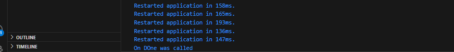

# Pertemuan 12 

# Praktikum 1

## Soal 1 
Tambahkan nama panggilan Anda pada title app sebagai identitas hasil pekerjaan Anda.
Gantilah warna tema aplikasi sesuai kesukaan Anda.

## Soal 2
Tambahkan 5 warna lainnya sesuai keinginan Anda pada variabel colors tersebut.

## Soal 3
Jelaskan fungsi keyword yield* pada kode tersebut!

Fungsi yield*: Menggabungkan atau meneruskan elemen/stream lain ke dalam stream saat ini.Mempermudah menyalurkan elemen dari stream lain tanpa harus mengiterasi dan menggunakan yield satu per satu.

Apa maksud isi perintah kode tersebut?

yield*: Digunakan untuk "meneruskan" semua elemen dari stream yang dihasilkan oleh Stream.periodic langsung ke stream utama (getColors).Dengan kata lain, semua data yang dihasilkan oleh Stream.periodic akan dikirimkan ke stream output dari getColors.

## Soal 4

## Soal 5

Jelaskan perbedaan menggunakan listen dan await for (langkah 9) !

await for digunakan untuk membaca data dari stream secara sequential dengan pendekatan asynchronous loop. Ini cocok untuk kasus sederhana di mana data diambil hingga stream selesai tanpa perlu menangani event seperti error atau interupsi.
listen memberikan kontrol penuh terhadap aliran data dalam stream, memungkinkan Anda menangani event seperti onData, onError, dan onDone. Metode ini cocok untuk kasus kompleks yang memerlukan pengelolaan error, atau ketika ingin menghentikan stream secara manual.

# Praktikum 2

## Soal 6

Jelaskan maksud kode langkah 8 dan 10 tersebut!

Inisialisasi (initState):
Membuat stream dan mendengarkan angka yang dipancarkan. Ketika angka baru dipancarkan, variabel lastNumber diperbarui.

Menambahkan Angka Baru (addRandomNumber):
Angka acak dibuat dan ditambahkan ke stream. Listener pada stream menerima angka baru dan memperbarui UI dengan angka tersebut.

## Soal 7
Jelaskan maksud kode langkah 13 sampai 15 tersebut!

addError di Stream:
Digunakan untuk mensimulasikan error dengan mengirimkan event error ke stream.

onError pada Listener:
Listener sekarang dapat menangani error yang dipancarkan oleh stream. Jika terjadi error, nilai variabel lastNumber akan diatur menjadi -1, menunjukkan kondisi error.

Mengubah addRandomNumber:
Mengalihkan fungsi untuk memicu error menggunakan addError, sehingga membantu dalam pengujian atau demonstrasi bagaimana aplikasi menangani error.

# Praktikum 3

## Soal 8
Jelaskan maksud kode langkah 1-3 tersebut!

stream.transform(transformer): Menerapkan StreamTransformer yang telah didefinisikan untuk memodifikasi data dalam stream sebelum sampai ke pendengar (listener).
listen((event) { ... }): Mendaftarkan pendengar ke stream untuk memproses setiap event (data yang dimodifikasi oleh transformer).
setState: Mengubah state lastNumber di widget dengan nilai terbaru dari stream (event).
onError((error) { ... }): Menangani error dari stream. Dalam kasus error, lastNumber diatur ke -1.

# Praktikum 4

## Soal 9

Jelaskan maksud kode langkah 2, 6 dan 8 tersebut!

Langkah 2: Menyiapkan stream, controller, dan subscription untuk mendengarkan data dari stream.
Langkah 6: Membatalkan subscription saat widget dihancurkan untuk mencegah kebocoran memori.
Langkah 8: Menambahkan angka acak ke stream jika controller belum ditutup; jika sudah ditutup, memperbarui UI dengan nilai khusus (-1).

# Praktikum 5

## Soal 10
Jelaskan mengapa error itu bisa terjadi ? 

Error Bad state: Stream has already been listened to. terjadi karena Anda mencoba mendengarkan (listen) pada stream yang sama lebih dari satu kali, tetapi stream default pada Dart hanya dapat memiliki satu listener aktif pada satu waktu.

## Soal 11

Jelaskan mengapa hal itu bisa terjadi ?
Ketika widget Text(values) menampilkan banyak nilai, hal ini disebabkan oleh mekanisme bagaimana values diperbarui di dalam kedua listener dari Stream yang sama

# Praktikum 6

## Soal 12

Jelaskan maksud kode pada langkah 3 dan 7 !

Langkah 3 membuat stream angka acak dengan interval 1 detik.
Langkah 7 menampilkan angka terbaru dari stream menggunakan widget StreamBuilder, 
yang memungkinkan pembaruan UI secara otomatis tanpa perlu logika manual tambahan.

## Soal 13

Jelaskan maksud praktikum ini ! Dimanakah letak konsep pola BLoC-nya ?

Pola BLoC diterapkan di bagian berikut:

Logika bisnis terpisah dalam RandomNumberBloc:
Input diterima melalui sink (generateRandom).
Output dikirim melalui stream (randomNumber).
Integrasi logika bisnis dan UI di random_screen.dart:
Input dipicu oleh FAB yang mengirimkan perintah ke sink.
StreamBuilder mendengarkan perubahan data dari stream dan memperbarui UI secara otomatis.
