PRAKTIKUM 1

Ketik atau salin kode program berikut ke dalam void main().

var list = [1, 2, 3];
assert(list.length == 3);
assert(list[1] == 2);
print(list.length);
print(list[1]);

list[1] = 1;
assert(list[1] == 1);
print(list[1]);
Silakan coba eksekusi (Run) kode pada langkah 1 tersebut. Apa yang terjadi? Jelaskan!

Jawab : 

var list = [1, 2, 3];: Membuat list (array) yang berisi tiga elemen: 1, 2, dan 3.
assert(list.length == 3);: Assertion digunakan untuk memverifikasi bahwa panjang list adalah 3. Jika tidak, program akan menghasilkan error ketika dijalankan dalam mode debug.
assert(list[1] == 2);: Memeriksa bahwa elemen pada indeks ke-1 (yaitu elemen kedua) bernilai 2. Jika tidak, assertion akan gagal.
print(list.length);: Mencetak panjang dari list, yaitu 3.
print(list[1]);: Mencetak elemen pada indeks ke-1, yaitu 2.
list[1] = 1;: Mengubah nilai elemen pada indeks ke-1 dari 2 menjadi 1.
assert(list[1] == 1);: Memeriksa bahwa perubahan tersebut berhasil, memastikan elemen pada indeks ke-1 sekarang bernilai 1.
print(list[1]);: Mencetak elemen pada indeks ke-1 yang sekarang bernilai 1.

Ubah kode pada langkah 1 menjadi variabel final yang mempunyai index = 5 dengan default value = null. Isilah nama dan NIM Anda pada elemen index ke-1 dan ke-2. Lalu print dan capture hasilnya.

Apa yang terjadi ? Jika terjadi error, silakan perbaiki.
berdasarkan kode dibawah tidak ada error karena list menggunakan dynamic list, sehingga tipa data yang digunakan dalam list dapat fleksibel.
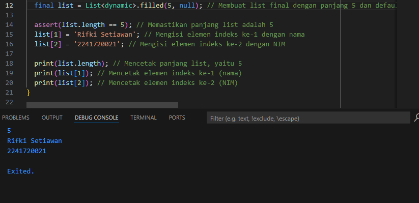

PRAKTIKUM 2

Ketik atau salin kode program berikut ke dalam fungsi main().

var halogens = {'fluorine', 'chlorine', 'bromine', 'iodine', 'astatine'};
print(halogens);
Silakan coba eksekusi (Run) kode pada langkah 1 tersebut. Apa yang terjadi? Jelaskan! Lalu perbaiki jika terjadi error.

Jawab : 
Berdaasarkan percobaan kode dibawah tidak terdapat error, dan program hayan menampilkan data yang terdapat pada suatu set halogens
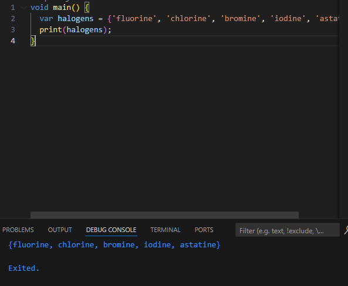

Tambahkan kode program berikut, lalu coba eksekusi (Run) kode Anda.

var names1 = <String>{};
Set<String> names2 = {}; // This works, too.
var names3 = {}; // Creates a map, not a set.

print(names1);
print(names2);
print(names3);

Apa yang terjadi ? Jika terjadi error, silakan perbaiki namun tetap menggunakan ketiga variabel tersebut. Tambahkan elemen nama dan NIM Anda pada kedua variabel Set tersebut dengan dua fungsi berbeda yaitu .add() dan .addAll(). Untuk variabel Map dihapus, nanti kita coba di praktikum selanjutnya.

Jawab : 
Berdasarkan peambahan kode program diatas tidak terjadi error, namun hanya menjalankan suatu set dan map kosong. 
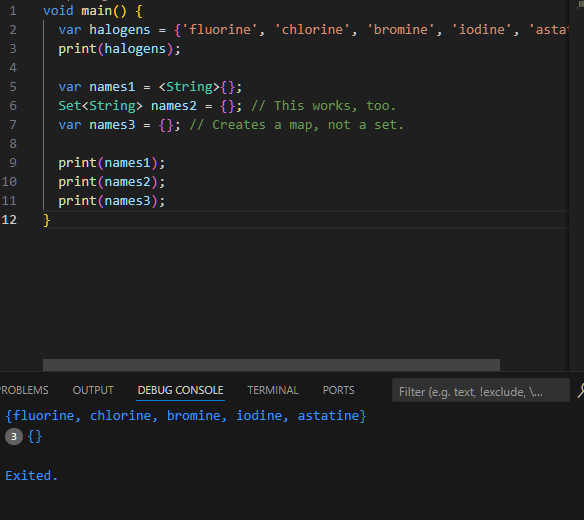

Penambahan kode : 
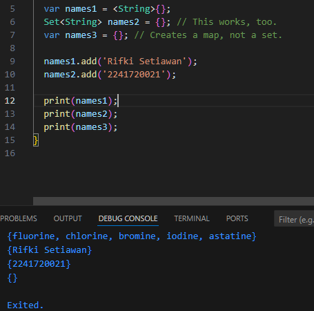

PRAKTIKUM 3 : 

Ketik atau salin kode program berikut ke dalam fungsi main().

var gifts = {
  // Key:    Value
  'first': 'partridge',
  'second': 'turtledoves',
  'fifth': 1
};

var nobleGases = {
  2: 'helium',
  10: 'neon',
  18: 2,
};

print(gifts);
print(nobleGases);
Silakan coba eksekusi (Run) kode pada langkah 1 tersebut. Apa yang terjadi? Jelaskan! Lalu perbaiki jika terjadi error.

Jawab : 
Berdasarkam kode berikut tidak ada error yang terjadi, Kode di atas mendeklarasikan dua buah **Map** di Dart, yaitu `gifts` dan `nobleGases`. Map adalah struktur data yang menyimpan pasangan **key-value** di mana setiap **key** harus unik. Pada `gifts`, key-nya berupa `String` ('first', 'second', 'fifth') dengan nilai beragam: dua string ('partridge', 'turtledoves') dan satu integer (1). Sedangkan pada `nobleGases`, key-nya berupa angka (`2`, `10`, `18`), dengan nilai berupa dua string ('helium', 'neon') dan satu integer (2). Kode ini kemudian mencetak isi dari kedua Map tersebut, di mana `gifts` dan `nobleGases` bisa berisi tipe data yang berbeda-beda baik pada key maupun valuenya.
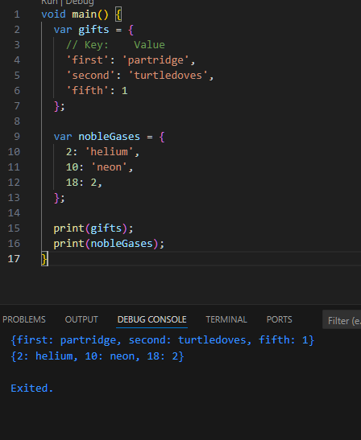

Tambahkan kode program berikut, lalu coba eksekusi (Run) kode Anda.

var mhs1 = Map<String, String>();
gifts['first'] = 'partridge';
gifts['second'] = 'turtledoves';
gifts['fifth'] = 'golden rings';

var mhs2 = Map<int, String>();
nobleGases[2] = 'helium';
nobleGases[10] = 'neon';
nobleGases[18] = 'argon';
Apa yang terjadi ? Jika terjadi error, silakan perbaiki

Jawab : 
Pada baris gifts['fifth'] = 'golden rings';, nilai yang sebelumnya '1' diubah menjadi 'golden rings', Pada baris nobleGases[18] = 'argon';, nilai yang sebelumnya 2 digantikan dengan 'argon'.
var mhs1 = Map<String, String>();: Ini adalah Map kosong yang hanya dapat menampung pasangan key-value berupa String. Namun, pada kode ini tidak ada elemen yang dimasukkan ke mhs1. var mhs2 = Map<int, String>();: Ini juga Map kosong yang key-nya berupa int dan valuenya berupa String, tetapi tidak ada elemen yang ditambahkan ke mhs2 di kode ini.

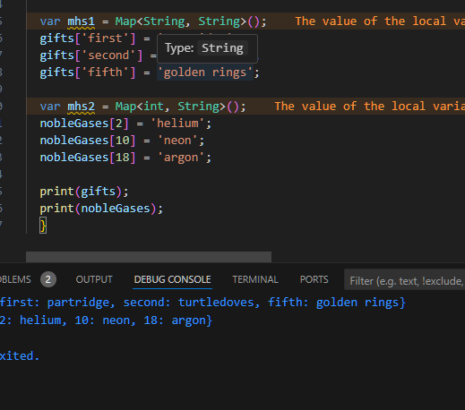

Setelah dilakukan modifikasi : 

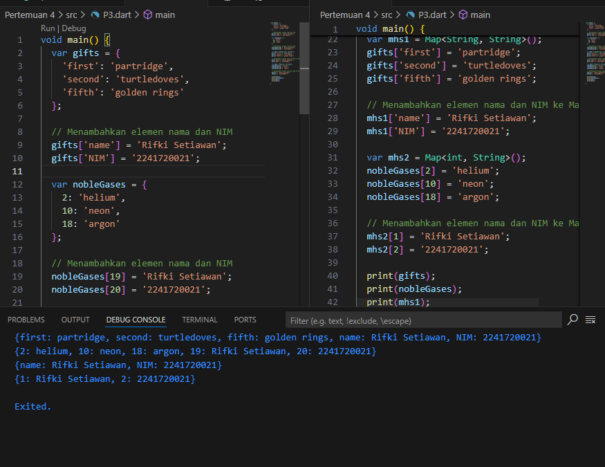

PRAKTIKUM 4 : 

Silakan coba eksekusi (Run) kode pada langkah 1 tersebut.
var list = [1, 2, 3];
var list2 = [0, ...list];
print(list1);
print(list2);
print(list2.length);
 Apa yang terjadi? Jelaskan! Lalu perbaiki jika terjadi error.

Jawab : 
pada kode tersebut terdapat error karena kesalahan dalam penulisan variabel list, karena list 1 tidak terdapat pada kode, sehingga diganti dengan variabel list yang sudah terdapat pada kode progam.

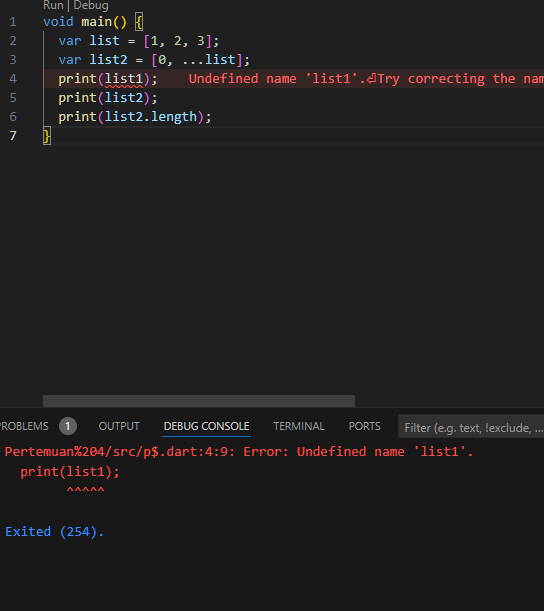

Tambahkan kode program berikut, lalu coba eksekusi (Run) kode Anda.

list1 = [1, 2, null];
print(list1);
var list3 = [0, ...?list1];
print(list3.length);
Apa yang terjadi ? Jika terjadi error, silakan perbaiki.
Jawab : 

kode tersebut error karena variabel list1 belum mempunyai tipe data, sehingga terjadi error.

Perbaikan : 
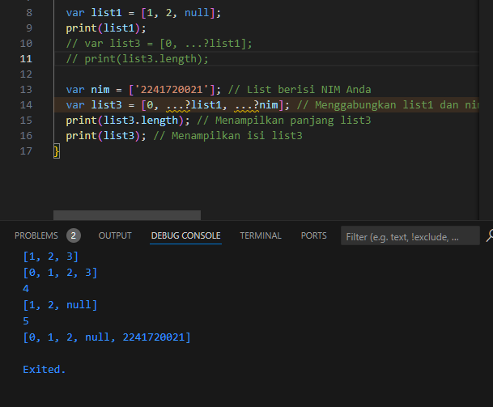

Tambahkan variabel list berisi NIM Anda menggunakan Spread Operators. Dokumentasikan hasilnya dan buat laporannya!

Jawab : 

Tambahkan kode program berikut, lalu coba eksekusi (Run) kode Anda.

var nav = ['Home', 'Furniture', 'Plants', if (promoActive) 'Outlet'];
print(nav);
Apa yang terjadi ? Jika terjadi error, silakan perbaiki. Tunjukkan hasilnya jika variabel promoActive ketika true dan false.

jawab : 
Berdasarkan kode program tersebut, setelah dijalankan terdapat error karena variabel bool masih belum dibuat, sehingga terjadi error seperti pada gambar berikut ini : 

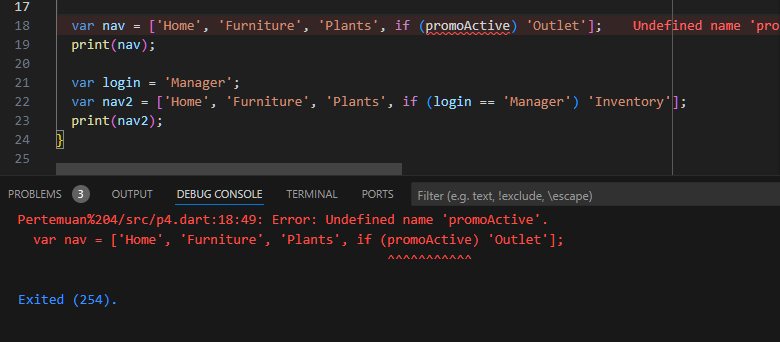

Perbaikan : 
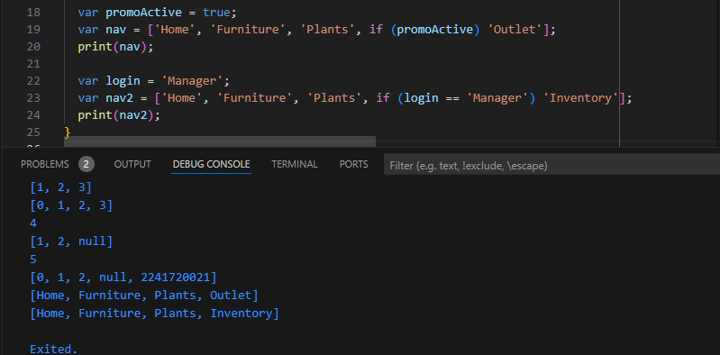

Tambahkan kode program berikut, lalu coba eksekusi (Run) kode Anda.

var nav2 = ['Home', 'Furniture', 'Plants', if (login case 'Manager') 'Inventory'];
print(nav2);
Apa yang terjadi ? Jika terjadi error, silakan perbaiki. Tunjukkan hasilnya jika variabel login mempunyai kondisi lain.

Jawab : 
Berdasarkan kode berikut error terjadi setelah kode tersebut dilakukan run, karena tidak ditemukan variabel login.
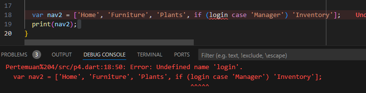

Perbaikan : 
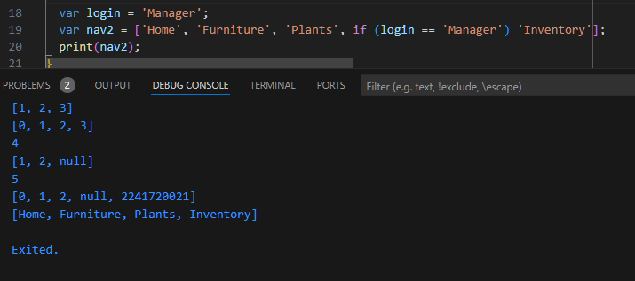

Tambahkan kode program berikut, lalu coba eksekusi (Run) kode Anda.

var listOfInts = [1, 2, 3];
var listOfStrings = ['#0', for (var i in listOfInts) '#$i'];
assert(listOfStrings[1] == '#1');
print(listOfStrings);

Apa yang terjadi ? Jika terjadi error, silakan perbaiki. Jelaskan manfaat Collection For dan dokumentasikan hasilnya.

jawab : 
Berdasarkan kode program setelah dirun tidak terjadi eror, Kode tersebut mendemonstrasikan bagaimana membuat list dinamis di Dart menggunakan list comprehension. Pertama, variabel listOfInts dideklarasikan sebagai list berisi bilangan bulat [1, 2, 3]. Kemudian, variabel listOfStrings dideklarasikan sebagai list berisi string, di mana elemen pertama adalah '#0', dan elemen-elemen selanjutnya dihasilkan dengan iterasi pada listOfInts. Setiap nilai dari listOfInts diubah menjadi string dengan format # di depannya (contohnya 1 menjadi '#1', 2 menjadi '#2', dan seterusnya). Pernyataan assert digunakan untuk memastikan bahwa elemen pertama setelah '#0' adalah '#1', dan hasil akhir list dicetak, yaitu ['#0', '#1', '#2', '#3'].

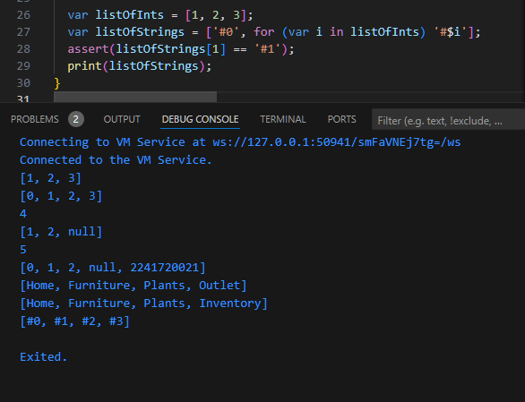

Praktikum 5 : 

Ketik atau salin kode program berikut ke dalam fungsi main().

var record = ('first', a: 2, b: true, 'last');
print(record)

Silakan coba eksekusi (Run) kode pada langkah 1 tersebut. Apa yang terjadi? Jelaskan! Lalu perbaiki jika terjadi error.

Jawab : 
Kode tersebut menggunakan fitur record di Dart untuk mengelompokkan beberapa nilai dengan dan tanpa label ke dalam satu entitas. Variabel record menyimpan nilai 'first' (tanpa label), a: 2 (nilai berlabel a), b: true (nilai berlabel b), dan 'last' (tanpa label). Saat dicetak, output akan berupa kumpulan nilai tersebut: ('first', a: 2, b: true, 'last'). Record memungkinkan penyimpanan beberapa nilai yang berbeda dalam satu variabel tanpa memerlukan kelas atau objek yang lebih kompleks.

Tambahkan kode program berikut di luar scope void main(), lalu coba eksekusi (Run) kode Anda.

(int, int) tukar((int, int) record) {
  var (a, b) = record;
  return (b, a);
}
Apa yang terjadi ? Jika terjadi error, silakan perbaiki. Gunakan fungsi tukar() di dalam main() sehingga tampak jelas proses pertukaran value field di dalam Records.

jawab : 
pada kode tersebut fungsi tukar belum bisa digunakan karena belum dideklarasikan 

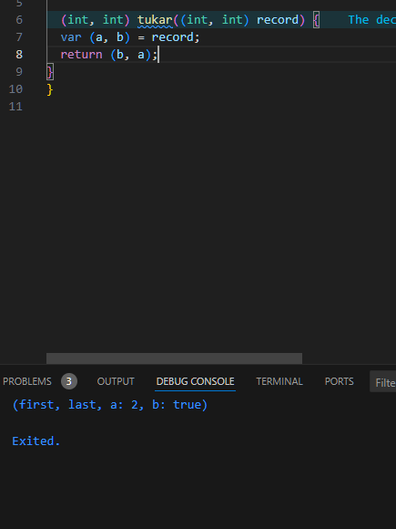

Perbaikan : 
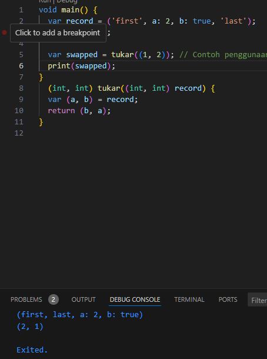

Tambahkan kode program berikut di dalam scope void main(), lalu coba eksekusi (Run) kode Anda.

// Record type annotation in a variable declaration:
(String, int) mahasiswa;
print(mahasiswa);
Apa yang terjadi ? Jika terjadi error, silakan perbaiki. Inisialisasi field nama dan NIM Anda pada variabel record mahasiswa di atas. Dokumentasikan hasilnya dan buat laporannya!

Jawab : 
Berdasarkan kode program yang diberi, terdapat suatu error, karena variabel mahasiswa belum dibentuk atau belum diinisialisasi.

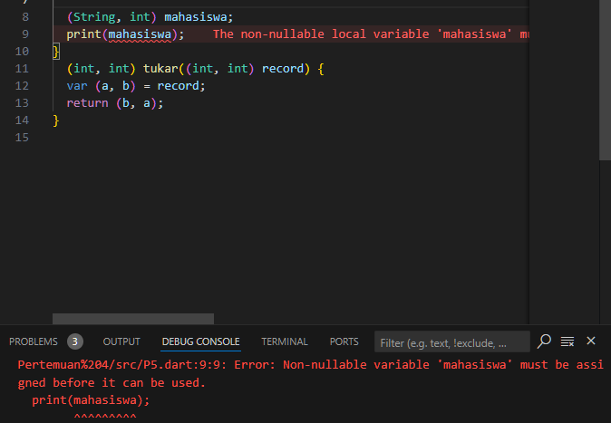

Perbaikan dan modifikasi : 
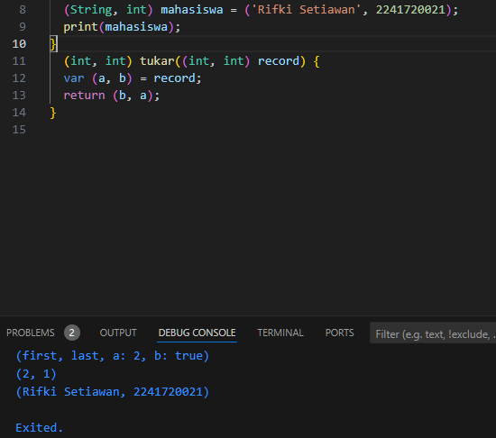

Tambahkan kode program berikut di dalam scope void main(), lalu coba eksekusi (Run) kode Anda.

var mahasiswa2 = ('first', a: 2, b: true, 'last');

print(mahasiswa2.$1); // Prints 'first'
print(mahasiswa2.a); // Prints 2
print(mahasiswa2.b); // Prints true
print(mahasiswa2.$2); // Prints 'last'
Apa yang terjadi ? Jika terjadi error, silakan perbaiki. Gantilah salah satu isi record dengan nama dan NIM Anda, lalu dokumentasikan hasilnya dan buat laporannya!

Jawab : 
Kode di atas mendemonstrasikan penggunaan record di Dart, di mana mahasiswa2 adalah sebuah record yang berisi nilai tanpa label ('first' dan 'last') serta nilai berlabel (a: 2 dan b: true). Akses elemen pada record dilakukan berdasarkan urutan atau labelnya. mahasiswa2.$1 mengacu pada elemen pertama (tanpa label) dan mencetak 'first', sementara mahasiswa2.a mengakses elemen berlabel a yang mencetak 2. Selanjutnya, mahasiswa2.b mencetak nilai true dari elemen berlabel b, dan mahasiswa2.$2 mencetak elemen kedua tanpa label, yaitu 'last'.

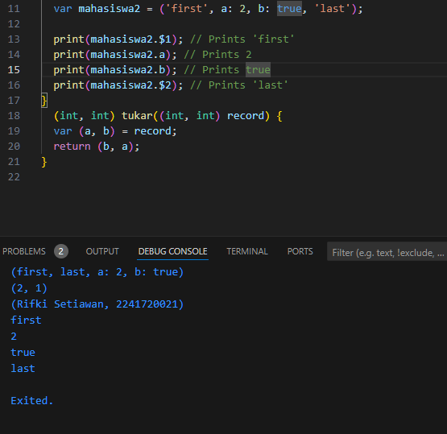

Modifikasi : 
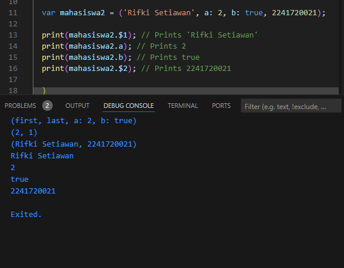

Tugas Praktikum : 
1. Jelaskan yang dimaksud Functions dalam bahasa Dart!
Fungsi (functions) dalam bahasa Dart adalah blok kode yang dapat digunakan kembali untuk menjalankan tugas tertentu. Fungsi bisa menerima input (parameter) dan mengembalikan output (return value). Fungsi dapat didefinisikan secara eksplisit dengan menggunakan kata kunci void (jika tidak mengembalikan nilai) atau dengan tipe data yang dikembalikan.

Contoh:

int tambah(int a, int b) {
  return a + b;
}

void main() {
  print(tambah(2, 3)); // Output: 5
}

2. Jelaskan jenis-jenis parameter di Functions beserta contoh sintaksnya!

Ada beberapa jenis parameter dalam Dart:

Positional Parameters: Parameter yang harus disediakan secara berurutan.

Contoh:

void greet(String name, int age) {
  print("Hello $name, you are $age years old.");
}
Optional Positional Parameters: Parameter yang bersifat opsional dan tidak wajib diberikan, menggunakan tanda kurung siku [].

Contoh:

void greet(String name, [int? age]) {
  if (age != null) {
    print("Hello $name, you are $age years old.");
  } else {
    print("Hello $name.");
  }
}
Named Parameters: Parameter yang diberikan namanya saat dipanggil, biasanya disertai dengan {} dalam definisi fungsi. Ini membuat kode lebih mudah dibaca.

Contoh:

void greet({required String name, int? age}) {
  print("Hello $name, you are $age years old.");
}

void main() {
  greet(name: 'Rifki', age: 21);
}
Default Parameters: Parameter opsional yang memiliki nilai default jika tidak diberikan.

Contoh:

void greet(String name, [int age = 18]) {
  print("Hello $name, you are $age years old.");
}

3. Jelaskan maksud Functions sebagai first-class objects beserta contoh sintaknya!

Dalam Dart, fungsi adalah first-class objects, artinya fungsi bisa disimpan dalam variabel, dikirim sebagai parameter, atau dikembalikan dari fungsi lain.

contoh : 

void greet(String name) {
  print("Hello, $name!");
}

void executeFunction(Function f, String name) {
  f(name);
}

void main() {
  var sayHello = greet;
  sayHello('Rifki'); // Output: Hello, Rifki!
  
  executeFunction(greet, 'Setiawan'); // Output: Hello, Setiawan!
}

4. Apa itu Anonymous Functions? Jelaskan dan berikan contohnya!

Anonymous functions adalah fungsi yang tidak memiliki nama. Mereka bisa didefinisikan di tempat dan biasanya digunakan ketika fungsi tidak perlu digunakan lebih dari sekali.

Contoh:

void main() {
  var list = ['apple', 'banana', 'orange'];
  
  list.forEach((item) {
    print(item);
  });
  // Output: apple, banana, orange
}

5. Jelaskan perbedaan Lexical scope dan Lexical closures! Berikan contohnya!

Lexical Scope: Merujuk pada aturan di mana fungsi dapat mengakses variabel yang dideklarasikan di luar fungsi itu selama dalam ruang lingkupnya.

Contoh:

var topLevel = 'Global';

void printScope() {
  print(topLevel); // Bisa mengakses variabel dari scope di atasnya
}

Lexical Closures: Merupakan fungsi yang "mengingat" lingkup (scope) variabel dari tempat fungsinya dideklarasikan, bahkan ketika dipanggil di luar lingkup tersebut.

Contoh:

Function createAdder(int addBy) {
  return (int i) => i + addBy;
}

void main() {
  var add5 = createAdder(5);
  print(add5(10)); // Output: 15
}

6. Jelaskan dengan contoh cara membuat return multiple value di Functions!

Dart tidak memiliki cara bawaan untuk mengembalikan beberapa nilai, tetapi bisa menggunakan List, Map, atau record (di Dart versi terbaru) untuk mengembalikan beberapa nilai.

Contoh menggunakan List:

List<int> getCoordinates() {
  return [10, 20];
}

void main() {
  var coordinates = getCoordinates();
  print(coordinates[0]); // Output: 10
  print(coordinates[1]); // Output: 20
}

Contoh menggunakan Record (Dart versi terbaru):

(String, int) getStudentInfo() {
  return ('Rifki Setiawan', 2241720021);
}

void main() {
  var (name, nim) = getStudentInfo();
  print(name); // Output: Rifki Setiawan
  print(nim);  // Output: 2241720021
}
Dengan menggunakan record, Dart bisa lebih efisien dalam mengembalikan beberapa nilai tanpa perlu menggunakan struktur data kompleks seperti List atau Map.