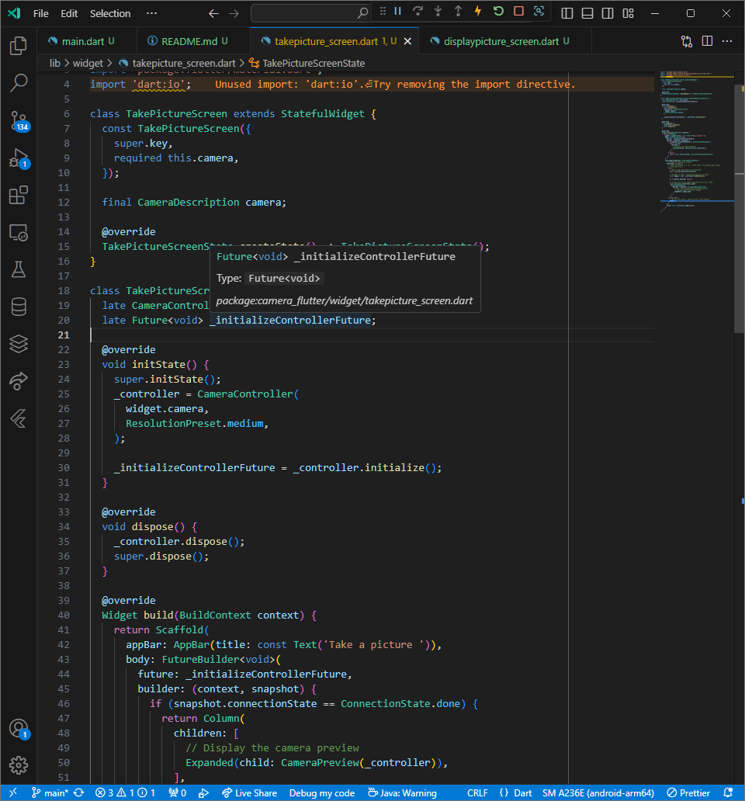
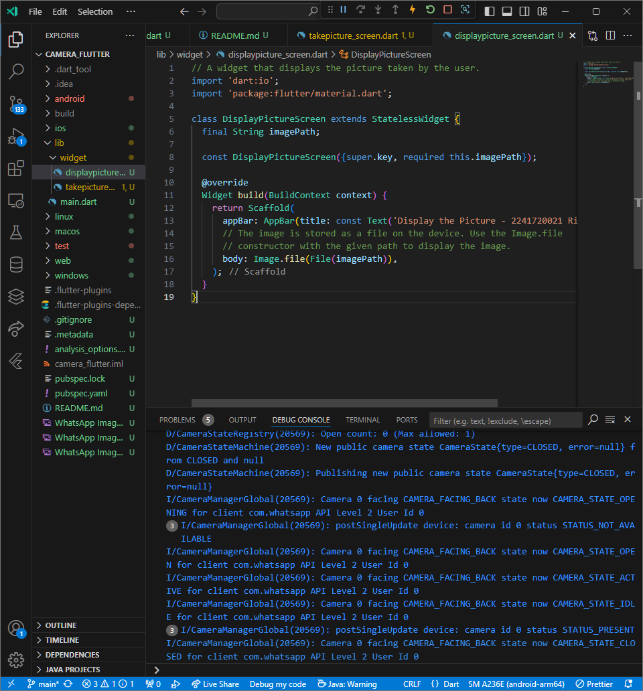

# camera_flutter

# Praktikum 1

## Tampilan take picture dart

### Dalam tampilan dibawah ini, digunakan untuk melakukan pengambilan gambar, yang akan menampilkan gambar yang ditangkap langsung oleh kamera.

## Tampilan gambar

### dalam tampilan dibawah ini, merupakan tampilan yang digunakan setelah foto berhasil ditangkap

